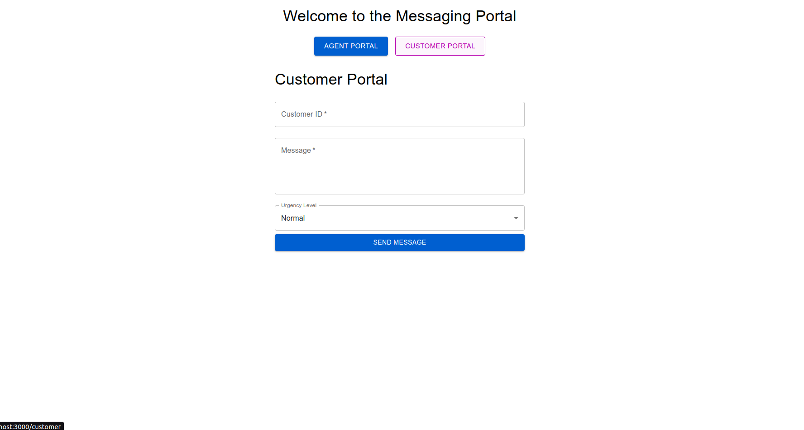
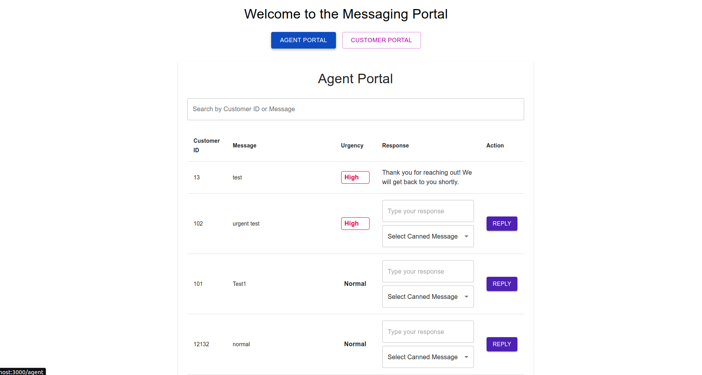
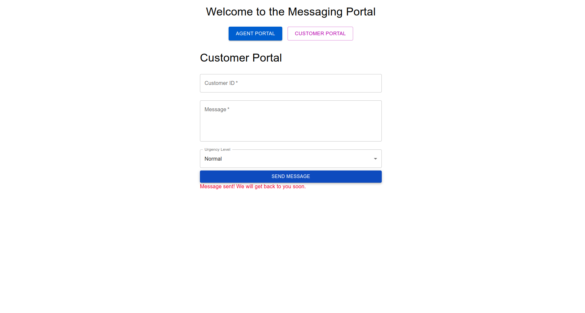
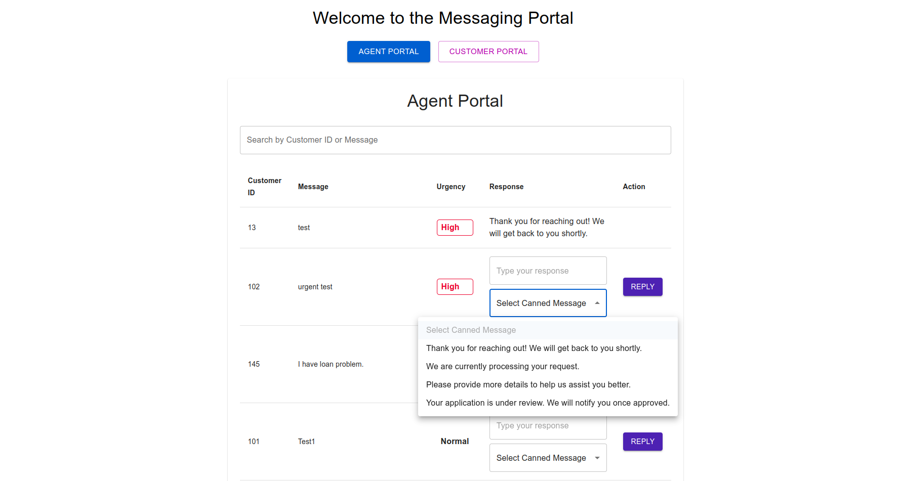
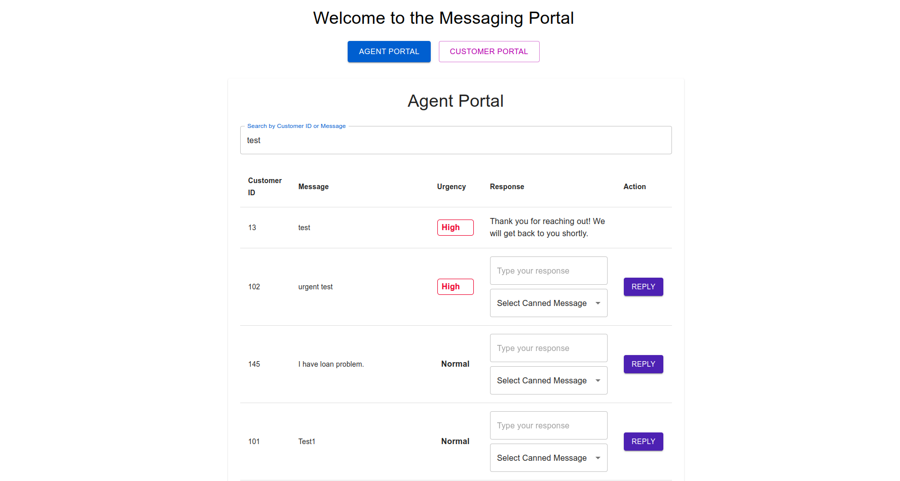

# Real-Time Messaging Portal

This project is a real-time messaging portal designed for agents to manage customer inquiries effectively. It features a responsive UI with real-time message updates, canned messages for quick responses, and search functionality for efficient filtering.

## Features Implemented
- **Real-time messaging**: Instantly display new messages and updates using Socket.IO.
- **Canned messages**: Agents can quickly respond to inquiries with pre-configured responses.
- **Search functionality**: Allows agents to filter messages by customer ID or message content.
- **Urgency-based sorting**: Messages with "high" urgency are highlighted and sorted to the top of the list.

## Setup and Installation

### Prerequisites
Ensure the following are installed on your machine:
- **Node.js** (v16.x or higher)
- **npm** (included with Node.js)
- **PostgreSQL** (v13.x or higher)

### Installation Steps

#### 1. Clone the Repository
```bash
git clone https://github.com/aashi-ihsaa/branchIn.git
cd branchIn
```

#### 2. Install Server Dependencies
Navigate to the `server` directory and install the necessary packages:
```bash
npm install
```

#### 3. Configure the PostgreSQL Database
1. Start PostgreSQL:
   ```bash
   sudo service postgresql start
   ```
2. Log in to PostgreSQL and set up the database:
   ```bash
   sudo -u postgres psql
   CREATE DATABASE messaging_portal;
   CREATE USER branch_user WITH ENCRYPTED PASSWORD 'yourpassword';
   GRANT ALL PRIVILEGES ON DATABASE messaging_portal TO branch_user;
   ```
3. Update the database connection settings in `/.env`:
4. Run migrations or scripts to set up the necessary `messages` table schema.

#### 4. Start the Server
From the directory, start the server:
```bash
node server.js
```

The server should now be running at `http://localhost:5000`.

#### 5. Install Client Dependencies
Navigate to the `branch_chat_frontend` directory and install the required packages:
```bash
npm install
```

#### 6. Start the Client
From the `frontend` directory:
```bash
npm start
```
The client application should be available at `http://localhost:3000`.

## Usage

1. **Viewing Messages**: Messages appear in a table, with urgent messages highlighted and sorted to the top.
2. **Replying to Messages**: Agents can type a custom response or select a canned message, then click "Reply" to send it.
3. **Searching Messages**: Use the search bar to filter messages by customer ID or content.
4. **Real-Time Updates**: New messages and replies appear instantly without needing a refresh.

## Additional Features Implemented

### Canned Messages
Allows agents to select from pre-configured responses for quicker replies to common questions.

### Real-Time Updates with Socket.IO
Messages and responses are updated in real-time, facilitating smooth communication between the customer portal and the agent portal.

### Search Functionality
Provides a search bar to help agents find messages by customer ID or message content.

### Urgency-Based Sorting
Messages marked as "high" urgency are automatically sorted to the top, enabling agents to prioritize these issues.

## Future Enhancements

- **Agent Work Distribution**: Implement a system to assign messages to specific agents and avoid duplicate handling.
- **Customer Context Display**: Display additional customer information (external/internal) for better context in handling inquiries.

## Screenshots







